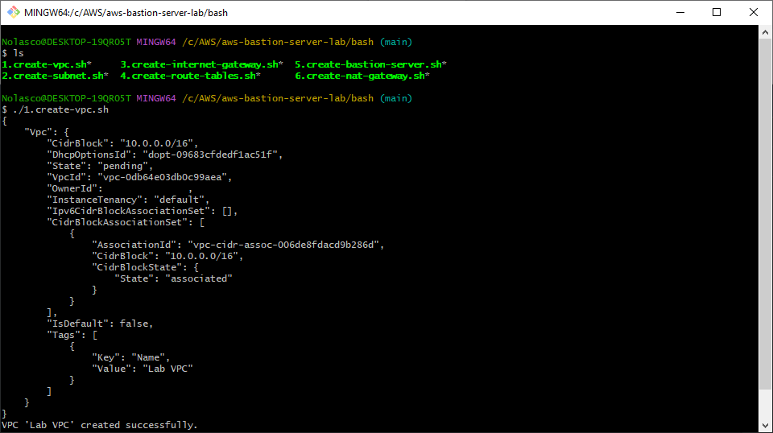
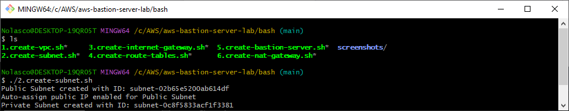
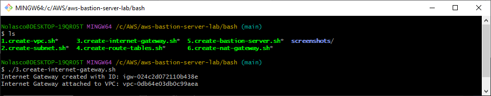
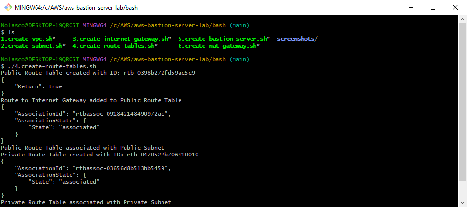
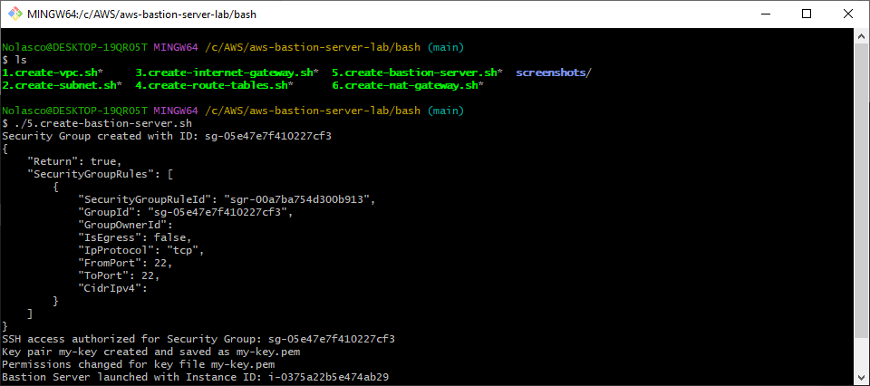
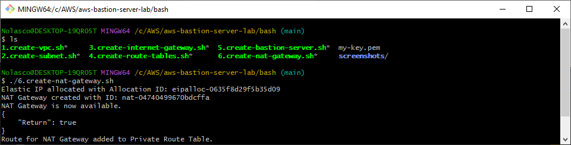

## Overview
You can execute these scripts as an alternative to manual resource creation in the AWS Management Console. 

## Execution Order

Please run the scripts in the following order:
- Edit the scripts according to your needs before running them

1. **Creating a VPC:**
```bash
./1.create-vpc
```

<div align="center">
  
</div>

---

2. **Creating Subnets:**
```bash
./2.create-subnet
```

<div align="center">
  
</div>

---

3. **Creating an Internet Gateway**
```bash
./3.create-internet-gateway
```

<div align="center">
  
</div>

---

4. **Configuring Route Tables:**
```bash
./4.create-route-tables
```

<div align="center">
  
</div>

---

5. **Launching a Bastion Server:**
```bash
./5.create-bastion-server
```

<div align="center">
  
</div>

6. **Create NAT Gateway:**
```bash
./6.create-nat-gateway
```

<div align="center">
  
</div>

7. **Cleanup:**
```bash
./7.cleanup
```

<div align="center">
  
</div>


